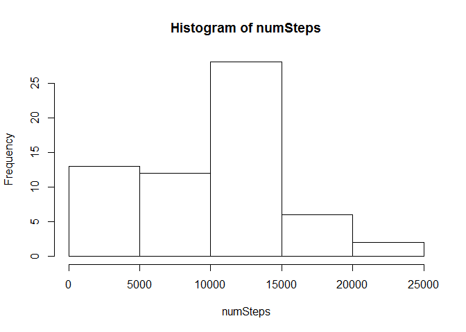
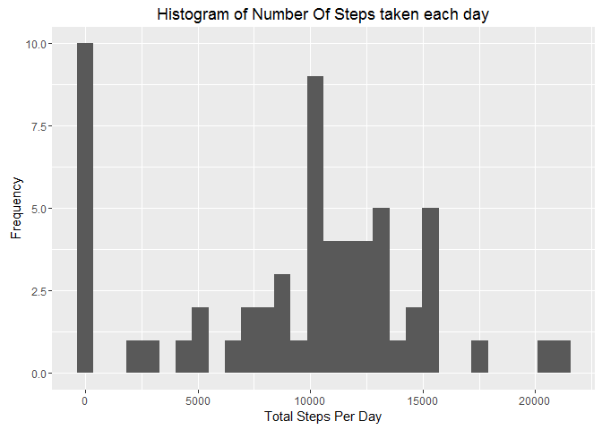
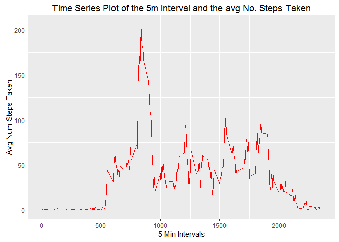
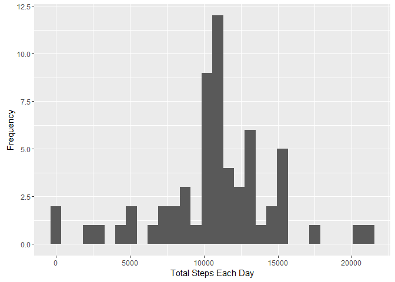
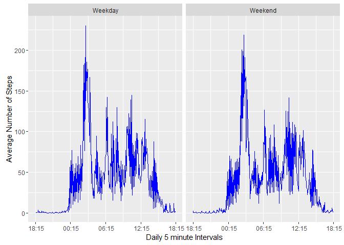

# Reproducible Research: Peer Assessment 1


## Loading and preprocessing the data

```r
if(!file.exists('activity.csv'))  
    unzip('activity.zip')  
activityData <- read.csv("activity.csv")  

#format the date
activityData$date <- as.Date(activityData$date, format="%Y-%m-%d")

#Create date/time column*-+

activityData$date.time <- as.POSIXct(
    paste(activityData$date, formatC(activityData$interval/100, 2, format = "f")), 
    format = "%Y-%m-%d %H.%M", 
    tz = "GMT")

#Format the time
activityData$time <- format(activityData$date.time, format = "%H:%M:%S")
activityData$time <- as.POSIXct(activityData$time, format = "%H:%M:%S")

activityData$interval <- as.factor(activityData$interval)

days <- as.factor(activityData$date)

intervals <- as.numeric(levels(activityData$interval))
```


## What is mean total number of steps taken per day?

Calculate the mean and median number of steps taken per day


```r
numSteps <- tapply(activityData$steps, activityData$date, sum, na.rm=TRUE)
str(numSteps)
```

```
##  int [1:61(1d)] 0 126 11352 12116 13294 15420 11015 0 12811 9900 ...
##  - attr(*, "dimnames")=List of 1
##   ..$ : chr [1:61] "2012-10-01" "2012-10-02" "2012-10-03" "2012-10-04" ...
```

```r
hist(numSteps)
```



```r
mean(numSteps)
```

```
## [1] 9354.23
```


```r
median(numSteps)
```

```
## [1] 10395
```

### Histogram of total number of steps taken each day

```r
library(ggplot2)

qplot(numSteps,xlab="Total Steps Per Day",ylab="Frequency",main = "Histogram of Number Of Steps taken each day")
```

```
## `stat_bin()` using `bins = 30`. Pick better value with `binwidth`.
```




## What is the average daily activity pattern?

Let's make a time series plot of the 5 minute intervals (x axis) and the average number of steps taken, averaged across all days (y axis)


```r
#calculate the mean steps for each interval
avgSteps <- tapply(activityData$steps, activityData$time, mean, na.rm=TRUE)

#create date frame with mean steps
activityPattern <- data.frame(time=as.POSIXct(names(avgSteps)),
                            avgSteps=avgSteps)

myPlot <- ggplot(activityPattern,aes(intervals, avgSteps), avgSteps=avgSteps)
myPlot +
    geom_line(colour="red") + 
    ggtitle("Time Series Plot of the 5m Interval and the avg No. Steps Taken") +
    xlab("5 Min Intervals") +
    ylab("Avg Num Steps Taken")
```



## Imputing missing values

Find missing values:


```r
#find rows of missing values
isNAs <- is.na(activityData)
countNA = sum(isNAs)
print(countNA)
```

```
## [1] 2304
```

Fill in missing values; we'll use the 5 minute interval mean to keep the data simliar


```r
#create a copy to preserve original
cleanData <- activityData

cleanData$steps[is.na(cleanData$steps)] <- 
    tapply(cleanData$steps, cleanData$interval, mean, na.rm = TRUE)

#compare the two
summary(activityData)
```

```
##      steps             date               interval    
##  Min.   :  0.00   Min.   :2012-10-01   0      :   61  
##  1st Qu.:  0.00   1st Qu.:2012-10-16   5      :   61  
##  Median :  0.00   Median :2012-10-31   10     :   61  
##  Mean   : 37.38   Mean   :2012-10-31   15     :   61  
##  3rd Qu.: 12.00   3rd Qu.:2012-11-15   20     :   61  
##  Max.   :806.00   Max.   :2012-11-30   25     :   61  
##  NA's   :2304                          (Other):17202  
##    date.time                        time                    
##  Min.   :2012-10-01 00:00:00   Min.   :2016-03-28 00:00:00  
##  1st Qu.:2012-10-16 05:58:45   1st Qu.:2016-03-28 05:58:45  
##  Median :2012-10-31 11:57:30   Median :2016-03-28 11:57:30  
##  Mean   :2012-10-31 11:57:30   Mean   :2016-03-28 11:57:30  
##  3rd Qu.:2012-11-15 17:56:15   3rd Qu.:2016-03-28 17:56:15  
##  Max.   :2012-11-30 23:55:00   Max.   :2016-03-28 23:55:00  
## 
```


```r
summary(cleanData)
```

```
##      steps             date               interval    
##  Min.   :  0.00   Min.   :2012-10-01   0      :   61  
##  1st Qu.:  0.00   1st Qu.:2012-10-16   5      :   61  
##  Median :  0.00   Median :2012-10-31   10     :   61  
##  Mean   : 37.38   Mean   :2012-10-31   15     :   61  
##  3rd Qu.: 27.00   3rd Qu.:2012-11-15   20     :   61  
##  Max.   :806.00   Max.   :2012-11-30   25     :   61  
##                                        (Other):17202  
##    date.time                        time                    
##  Min.   :2012-10-01 00:00:00   Min.   :2016-03-28 00:00:00  
##  1st Qu.:2012-10-16 05:58:45   1st Qu.:2016-03-28 05:58:45  
##  Median :2012-10-31 11:57:30   Median :2016-03-28 11:57:30  
##  Mean   :2012-10-31 11:57:30   Mean   :2016-03-28 11:57:30  
##  3rd Qu.:2012-11-15 17:56:15   3rd Qu.:2016-03-28 17:56:15  
##  Max.   :2012-11-30 23:55:00   Max.   :2016-03-28 23:55:00  
## 
```

Histogram of the new Data Set


```r
cleanNumSteps <- tapply(cleanData$steps, cleanData$date, sum)

qplot(
    cleanNumSteps, 
    xlab='Total Steps Each Day', 
    ylab='Frequency')
```

```
## `stat_bin()` using `bins = 30`. Pick better value with `binwidth`.
```




## Are there differences in activity patterns between weekdays and weekends?

Create a new factor variable in the dataset with two levels - "weekday" and "weekend" indicating whether a given date is a weekday or weekend day.


```r
#add Day to our cleanData
cleanData$Day <- weekdays(as.Date(as.character(cleanData$date)))

#add weekend value to our cleanData
cleanData$DayType <- as.factor(c("Weekend","Weekday"))

weekendDays <- cleanData$Day == "Saturday" | cleanData$Day == "Sunday"

cleanData$DayType[weekendDays] = "Weekend"
cleanData$DayType[!weekendDays] = "Weekday"


cleanAvgSteps <- tapply(cleanData$steps, 
                        interaction(cleanData$time, cleanData$DayType),
                        mean)

cleanPattern <- data.frame(time=as.POSIXct(names(cleanAvgSteps)), 
                           cleanAvgSteps = cleanAvgSteps, 
                           DayType = as.factor(c("Weekend","Weekday")))
```
Make a panel plot containing a time series plot (i.e. type = "l") of the 5-minute interval (x-axis) and the average number of steps taken, averaged across all weekday days or weekend days (y-axis).


```r
library(scales)

ggplot(cleanPattern, aes(time, cleanAvgSteps)) +
    geom_line(color="blue") +
    xlab("Daily 5 minute Intervals") +
    ylab("Average Number of Steps") +    
    scale_x_datetime(labels = date_format(format =' %H:%M')) +
    facet_grid(. ~ DayType)
```



